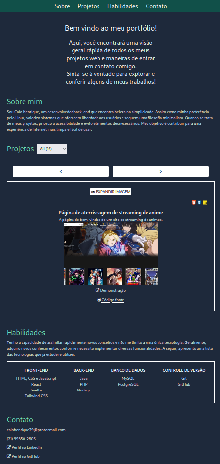

# Portfolio

Welcome to my portfolio! Explore a collection of my projects, get in touch with
me easily, and find links to my social media profiles.

## Preview

## Running on your machine

To run this project locally, follow these steps:

1. Clone the repository
   (`git clone https://github.com/caiohenrique-3/portfolio.git`)

2. Navigate to the project directory (`cd portfolio`)

3. Install dependencies (`npm install`)

4. Start the development server (`npm run dev`)

The project will be accessible at http://127.0.0.1:8080.

## Contributing

To contribute to this project, follow these steps:

1. Fork the repository
2. Create a new branch (`git checkout -b feature`)
3. Make your changes and commit them (`git commit -m 'Add new feature'`)
4. Push to the branch (`git push origin feature`)
5. Open a pull request

## Issues

If you encounter any issues or have suggestions for improvements, please
[open an issue](https://github.com/caiohenrique-3/portfolio/issues).

## License

This project is licensed under the [MIT License](LICENSE).

---
